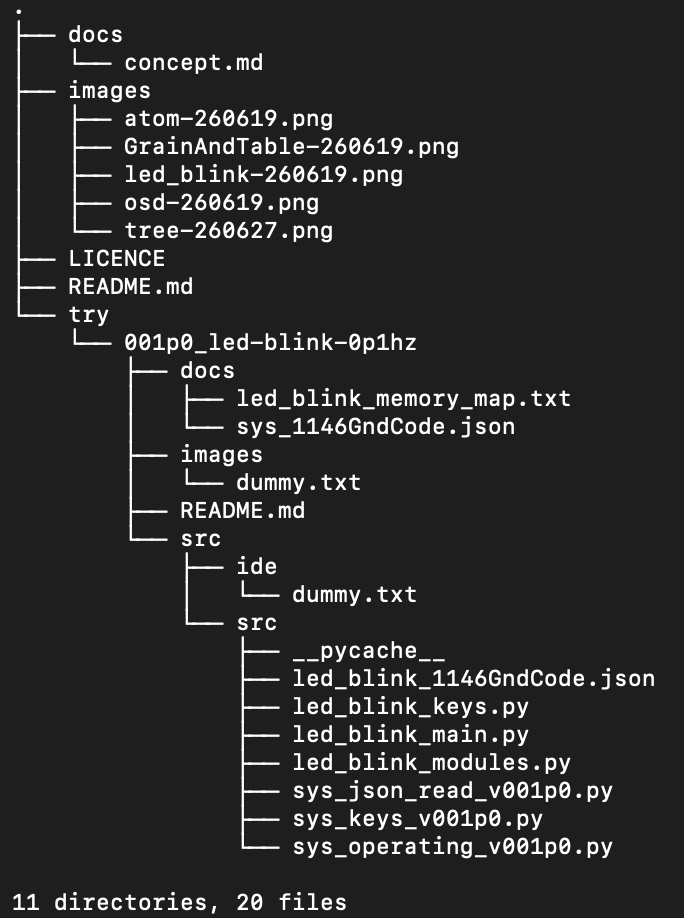

# 1146Gnd

## これは何か

- ソフトウエアの開発の工程の一本化のための思考実験

## 現在の到達点

- PythonとJSONを組み合わせて、Lチカをコンソールに出力した

## One Source Development(OSD)とは

ソフトウェア開発では、以下の分断が起きがちな、

- 要件定義（文章）
- 設計（図や資料）
- 実装（コード）
- テスト（別のコードや手順）

を、一つのソースコード(One Source)にまとめて、
各工程から別工程への参照を簡単にする開発方法に
One Source Development(OSD)と(ChatGPTが)名前をつけた。

## 1146GndCodeとは

1146Gndにおいて参照を簡単にするためのコード。
現在は、PythonとJSONで表している。

## 最初のサンプル: LED Blink 0.1Hz

思考実験の題材として、
LED(コンソールへの「LED ON」「LED OFF」出力)を変更する1146GndCodeを作成し、
何を書くべきかを、整理した。

## 用語

### grain(粒)

最小単位。現在、Pythonのモジュールとメモリ。Headerは未実装。

- Header
- module
- system memory
- working memory

### _table(_テーブル)

いくつかのGrainを束ねて使用する場合にテーブルにの形にする。以下はテーブル。

- atom(原子)
- molecule(分子)
- _system(_システムメモリ)
- _working(_アプリケーションの作業用メモリ)
- scoop(掬)
- drop(落)
- block(塊)
- branch(分岐)

### atom(原子)

要件定義から切り出した最小単位。

- 処理(run)
- 処理(run)+分岐(branch)

他に

- 初期化(init)
- アイドル(idle)

などとメモリ

- _system(_システムメモリ)
- _working(_作業用メモリ)
- scoop(掬)(外部から参照される作業用メモリ)
- drop(落)(外部を参照するメモリ)

を持つ。初期化(init)後、アイドル(idle)状態で他からの「idle_to_run_fg」の書き換えを待ち、  
メモリを用いて処置(run)を行い、必要に応じて分岐(branch)する。

なおAtom(原子)は処理(run)はPythonのモジュール。

### molecule(分子)

- Atom(原子)の処理(run)が、Block(塊)になったもの。

### _system(_システムメモリ)

- 全てのAtom共通で、Atomが動くために必要なメモリ。

### _working(_作業用メモリ)

- 一つのAtom専用のメモリ。他のAtomで必要な場合はscoop(掬)にも同じメモリをリストアップする。

### scoop(掬)

- _working(_作業用メモリ)のうち、他のAtomで使用するメモリ。

### drop(落)

- Atomが外部のAtomを参照するメモリ。外部のAtomでscoop(掬)されている必要がある。
- dropだけPythonのモジュールでのkeyは atom_name.func_name 形式になってる。(要検討^^;;;)

### block(塊)

- その他雑多テーブルは全部Block(塊)と呼ぶ。

### run(処理)

- Atom(原子)でPythonのモジュール
- Molecule(分子)でBlock(塊)。Tableで最初のAtomとscoop/dropを指定する？(未実装)

### branch(分岐)

- 処理の後に実行するものを書くテーブル。

### port(穴)

- IDEでAtom/Molecule/Blockと他を繋ぐ時に起点をport(穴)と呼ぶ。

### wire(線)

- IDEでAtom/Molecule/Blockと他を繋ぐやつをwire(線)と呼ぶ。

### diff_map(差分地図)

- 将来的に似たような機能を持つものは、「差分」をgit的な仕組みで一つにまとめて扱いたい。
- 一つにまとめたものが散らばるはずなので、「地図」で管理する。

### アドレス空間(Pythonのハッシュの代わりの文字列の表現のルール)

基本構成

- A.B.name.func
- アドレスタイプA.アドレスタイプB.Atomの名前.Atom内での機能名

アドレスタイプA

- addGrain: for Python Memory and Module name
- addAMB: for Atom, Molecule and Block name
- addBranch: for BranchTable name
- addMemory: for Memory system working scoop and drop name
- addNop: for comment to human

アドレスタイプB

- mod: python module
- sys: python memory operating system memories
- mem: python memory working memories
- scoop: output memories
- drop: input memories
- branch: branch table
- atom: atom
- molecule: molecule
- block: block

Atomの名前(Lチカのサンプルの場合は下記の通り)

- clock_tick
- blink_pattern
- led_driver
- wc: wild card

Atom内での機能名(Lチカのサンプルの場合は下記の通り)

- tick_500ms
- tick_500ms_is_used
- ...
- res: reserve

### Atom/Molecule の構成

この順番に固定する。

- header_reserved
- operating
- init
- idle
- run
- branch
- delete
- sys
- mem
- scoop
- drop

## リポジトリ構成

1146gnd  
  
図.tree

## 実行方法

スタート

- cd try/001p0_led-blink-0p1hz/src/src
- python3 led_blink_main.py
- python3 led_blink_main.py 20

停止

- ctrl + c

## 今後の予定

- この1146GndCodeを書き表し可視化するためのIDE(統合開発環境)を作成します。
- IDE により 要件定義とAtomとを関連づける方法を考えており、これを実装していきます。
- 上記に、テストやログを加えられるよう、検討し、実装していきます。

## 注意: experimental / draft

- これは、完成した仕様ではなく、思考実験の進行ログとして更新していきます。

## 履歴

### 2026-06-28T15:08:53+0900 led blink 0.1Hz 1st release

- 同時に 1146Gnd の思考実験(try)としての Lチカ を GitHubに初登録。

### 2026-06-28T15:08:53+0900 OSD:1146Gnd draft release

- OSD(One Source Development) および 1146Gnd の考え方/目指すところ などGitHubに初登録。
