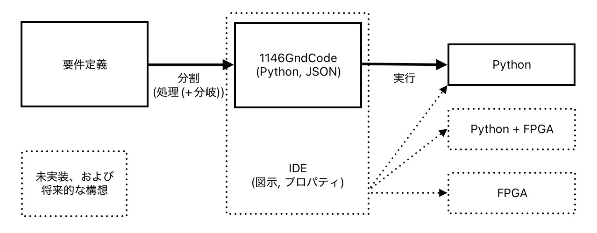
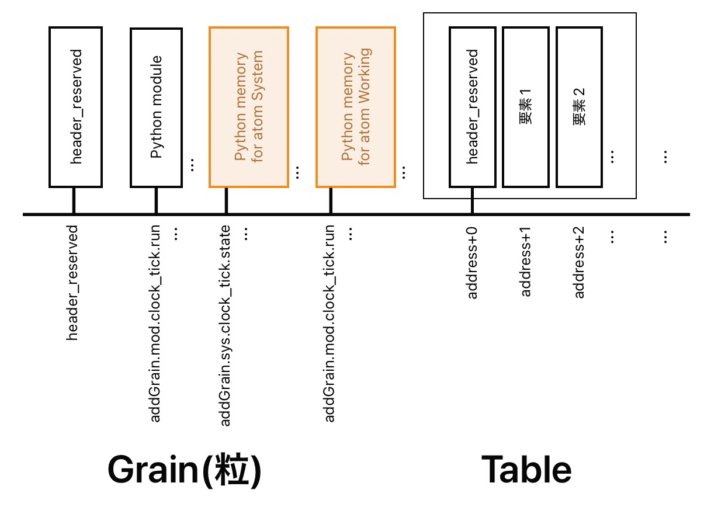
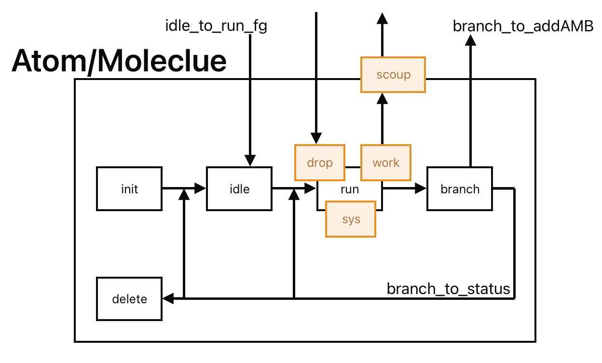
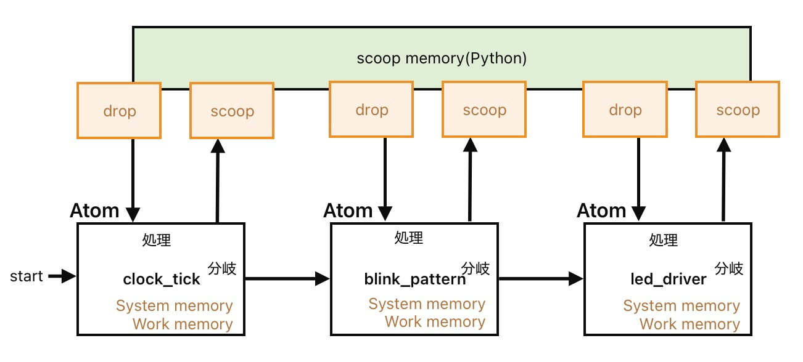

# OSD と 1146Gnd の コンセプト

## 1. なぜOSD(One Source Development)を考えたか

ソフトウェア開発では、以下の分断が起きがち。

- 要件定義（文章）
- 設計（図や資料）
- 実装（コード）
- テスト（別のコードや手順）

工程の最初から最後まで、通して**同じ開発環境**を使用することで、  
意思疎通の密度が上がるのではないか？と考えた。  
この考え方を**OSD**(**One Source Development**)と呼ぶことにする。

図.要件定義を分解してコードにして実行

### 1.1 (ご参考)似た目的を持つ開発方法

「仕様駆動開発」という点について

- AWS Kiro([Kiro のご紹介](https://aws.amazon.com/jp/blogs/news/introducing-kiro/))

「一貫した開発」という点について

- Google Antigravity([Google Antigravity(英語)](https://antigravity.google))

## 2. OSDの一つの解答としての1146Gnd。そしてそのアプローチ

- 独自解釈な「オブジェクト指向」を採用する。
- 文章 - 図や言葉の定義 - ソースコード - テスト をブラウジングできることを目指す(1146GndCode+IDE)。
- 全ての要素を同一アドレス空間(Gnd)に並べて、どこからでもアクセス可能にする。
- 他の言語で採用されている「隠蔽」的な役割は、IDE(統合開発環境)が分担する。(Rustインスパイヤード)

**1146GndCodeは「隠す」のではなく「全部出す」方向**に振ります。

## 3. 1146Gnd のタイムテーブル

### 3.1. 1146GndCode (JSON+Python or FPGA+Python or FPGA+マシン語)

- 思考実験として、PythonとJSONを組み合わせた実装を行う。
- まずは、Lチカを題材にし、JSONやその他の仕組みを決めていく。
- **仮公開**(<--- **現在地**)
- 上記思考実験を作者以外も試せるように、IDEの作成する。
- A. JSONの書式の検討
- B. PC上での実用性のあるアプリケーションの実験的実装。
- AとBを繰り返すことで、動く1146Gndを作成していく。
- 本公開。
- Shrike-liteのような、Python動作CPU+FPGAへの移植。
- Pythonの部分をマシン語に置き換えた、CPU内蔵FPGAへの移植。

### 3.2. OSDとしての1146Gnd

上記の思考実験などは、以下の項目から、どの項目も参照可能となるよう設計(意識)する。

- 要件定義
- 要件定義内のワードの細分化(処理および処理と分岐および「Block(塊)」による分類)
- 図や資料
- 1146GndCode
- 実行時のlog
- 自動テスト ---> 自動テストのlog
- 人間によるテスト(誰がいつ実施したか)
- 承認(誰がいつ承認したか)
- 履歴(誰がいつ変更したか)
- FPGAなど実メモリ空間への展開

## ４. 1146Gnd の特徴/新規性/先祖返り

### 4.1. 構造の平等化

構造の平坦化

- 昔の16bit64KByteアドレス空間(0x0000〜0xFFFF)に全てが並んでいるようなイメージ。
- Pythonでは、ハッシュ値+listで代用する。
- と言いつつ、ハッシュ値は人間が辛いので、意味のあるユニークな文字列で代用している。

以下をすべて同じレベルで扱います

- ヘッダーGrain(粒)：(未実装。仮で１アドレスを占有)
- module Grain(粒)：(Python module)
- atom system memory Grain(粒)：(Python memory)
- atom working memory Grain(粒)：(Python memory)
- 各種テーブルの先頭：「4.3 headerベース構造」で述べます

図.GrainとTalbe

### 4.2. アドレス空間モデル

すべての要素はアドレスを持ちます。

- 現在：可読なユニーク文字列（ハッシュ代用）
- 将来：ハッシュ値（256bitなど）を想定
- 長期的将来(ハードウエア系)：FPGAに舞台を移し、実アドレス化/仮想アドレス化
- 超長期的将来(ブラウザ系)：ブラウザへの最適化(Rustへの移植/WASM化)

### 4.3. headerベース構造

- atom: 原子
- molecule: 分子 (現在未使用。atomのrunがpython-moduleではなくblockになることを予定)
- block: 塊 (現在未使用。雑多？な役割を割り当てる予定)
- _system:_システムメモリ
- _working:_作業用メモリ
- scoop: 掬
- drop: 落
- branch: 分岐

### 4.4. Atom/Moleculeの構造

- 生成されると、「init(現在dummy)」され、「idle」状態になる。
- 他のAtomから「sys.idle_to_run_fg」が書き換えられると、「idle」から「run」に移る。
- Atomの場合GrainにあるPythonのモジュールが呼ばれる(処理)。
- runの処理が終わるとジャンプテーブルの番号を決定し「branch」に移る。
- Pythonでは、実行中のAtomのクラスの「branch_to_addAMB」を書き換える。

図.Atom/Moleculeの構造

### 4.5. offsetベース配列

各種テーブルの先頭にlist構造にします。
また、pythonでは、アドレスの文字列に使用した名前を元に  
dict構造でアドレスを解決しているため、次のように分けられます。

#### 4.5.1. 構造が固定されているもの(位置に意味があるもの)

- atom: 原子
- molecule: 分子

#### 4.5.2. Pythonで位置に意味はないもの（FPGAでは位置（offset）でアクセスを想定してます）

- block: 塊
- _system:_システムメモリ
- _working:_作業用メモリ
- scoop: 掬
- drop: 落

#### 4.5.3. 位置に意味はないけど、何番目かを外部から指定するもの(単独で位置を動かしてはいけないもの)

- branch: 分岐

### 4.6.言語と防爆の分離

言語は危険な構造も許容します。

- 1146GndCodeは何でも書ける
- 危険な構造も許容する

IDEによる安全性の確保。

- 可視化ツール
- 検証ツール

## 5. Lチカでの適用

### 5.1 使用Atom(原子)

- ClockTick
- BlinkPattern
- LedDriver

図.Lチカ(LED Blinck)

### 5.2 役割分担

- ClockTick：時間イベント
- BlinkPattern：ON/OFF判断
- LedDriver：出力

### 5.3 実行モデル（現在）

- ClockTickが常時動作
- 他Block(塊)はアイドル
- Tickで順次起動（擬似直列）

## 6. 現在の制限・未解決

- 串刺し塊（projection Block）の未導入
- call & return(戻り先ブロックを新規追加System Memoryに記録してから分岐、など)

## 7. 今後の方針

### 7.1 近いステップ

- 停止方法の検討(現在はcontrol+c)
- system memoryの整理
- atom class 内の operating_main の再検討
- call & return 方式の検討と導入

### 7.2 中期

- 可視化ツール
- IDEによる防爆支援
- projection block など、汎用block構造の追加
- 要件定義〜テスト を一括管理するOSDを実現する1146GndCodeのエディタ

### 7.3 長期(ハードウエア系)

- JSON + Python (←現在の目的地)
- 実/仮装アドレス空間 + FPGA実装 + Python
- 実/仮装アドレス空間 + FPGA実装 + マシン語

### 7.４ 超長期(ブラウザ系)

- JSON + Python (←現在の目的地)
- ハッシュアドレス空間対応
- Rust/WASM での ブラウザへの最適化

## 8. 設計思想まとめ

- すべてを見える形で持つ
- 構造を隠さない
- 制約より観測で守る
- まず爆発させる ---> 防爆を考える ---> 繰り返してブラッシュアップする。

## 9. (ご参考)作成の原点

ChatGPTさんに色々書かされたけど、次の動機が原点である。

- パワポが動け。
- 2次元空間(図や文章)での説明の限界！でもビデオとかを延々観たくない！
- 隠蔽化とかめんどくさい！昔の16bitアドレス空間的でいいじゃん！
- if文の拡張。switch文の脱自由度。---> FPGAで処理したら速くならない？
- 上流の作業と下流の作業の一本化(意思疎通のコストの最小化)
- 報告書作成時のパワポの図と動作するコードとの整合性を！

### 9.1. (ご参考)if文の拡張の現在地(グラグラ揺れてる...)

- 4bit + 12bit = 16bit
- 4bit: 0b0000: don't care
- 4bit: 0b0001-0b1110: 1〜14 の分岐先 ---> 値の量子化にも使えそう
- 4bit: 0b1111: 12bit拡張を使用する。
- 12bit: 0x001-0xFFE: 1〜4094 の分岐先

## 10. Notes

このドキュメント/1146Gndは完成した仕様ではなく、
設計の進行ログとして公開・更新していきます。

Atomなど、重要そうなキーワードも変えるかもしれません。
(だいぶん、落ち着いてきましたので、これでいけそうな気はしてますが、気のせいの可能があります...)
